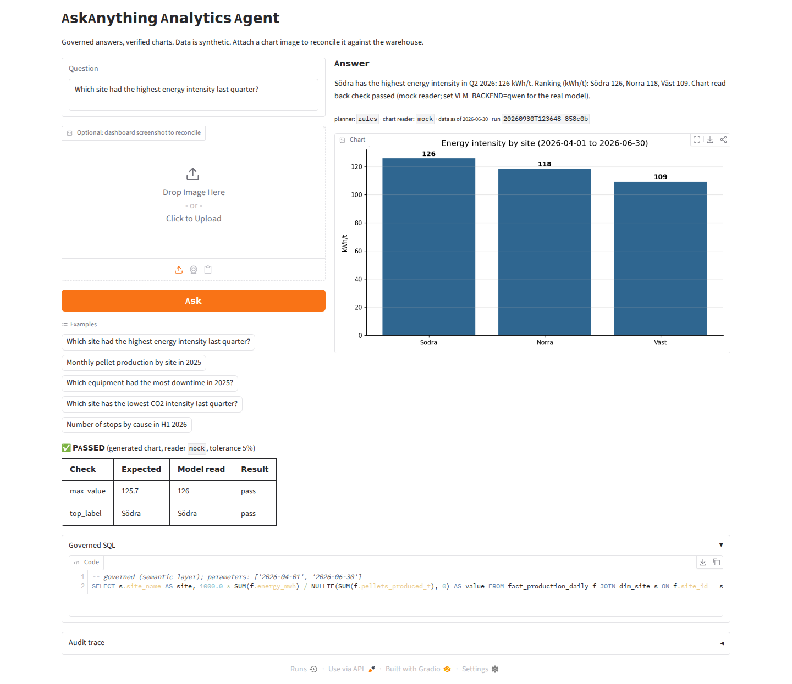
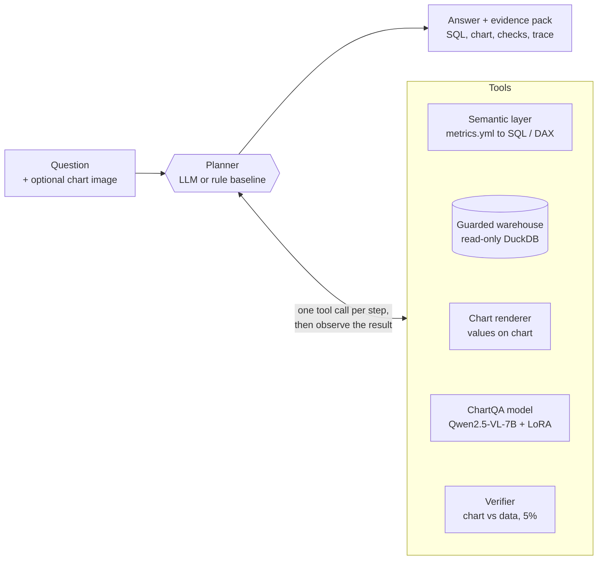
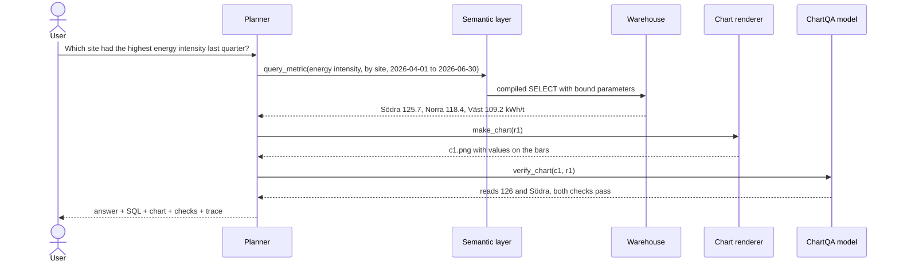
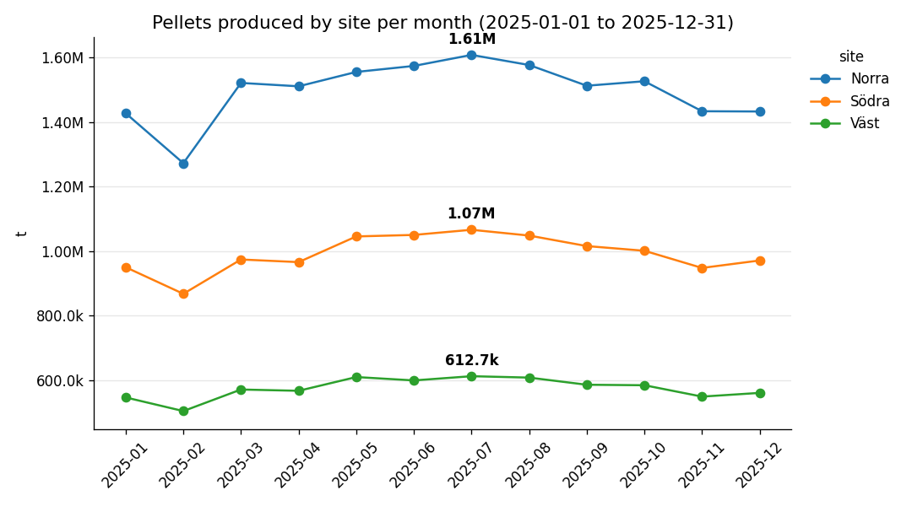
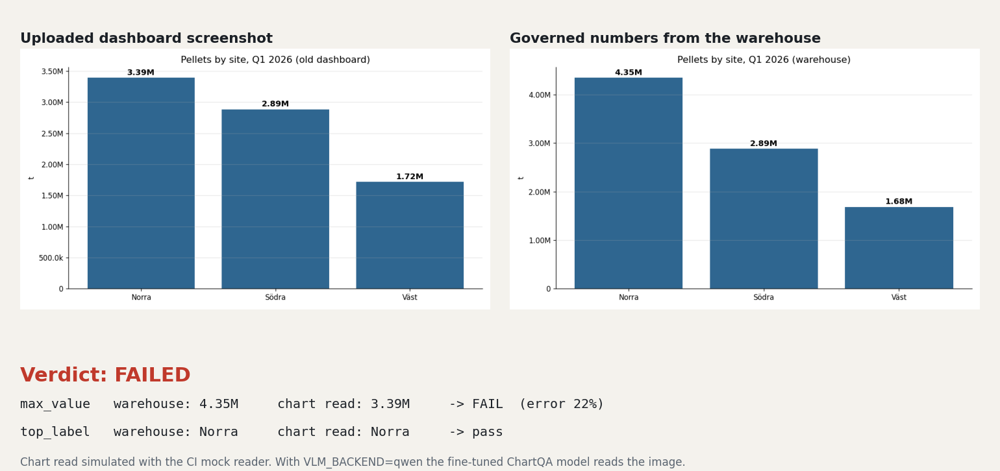

# AskAnything Analytics Agent

**An agentic analytics layer on top of a fine-tuned chart-understanding model.** Ask a business question in plain language and get a governed number, a chart, and a check that the chart matches the data. You can also upload a dashboard screenshot and have it checked against the warehouse.

> This branch extends [**AskAnythingInCharts-Qwen2.5-7B**](https://github.com/prakashchhipa/AskAnythingInCharts-Qwen2.5-7B) by Prakash Chandra Chhipa, which fine-tunes Qwen2.5-VL-7B with LoRA for chart question answering (ChartQA **57.5% → 66.0%**). The model work is unchanged; everything under `agentic/` plus the tests, evaluation, CI and UI are new in this branch.

[](https://github.com/<your-username>/AskAnythingInCharts-Qwen2.5-7B/actions/workflows/agentic-ci.yml)
[](https://huggingface.co/prakashchhipa/Qwen2.5-VL-7B-ChartQA-LoRA)
[](#the-chartqa-model)
[](tests/test_agentic.py)
[](LICENSE)


<sub>A real run in the web UI (`python -m agentic.ui`): the answer, the chart the agent drew, the check that the chart matches the data, and the governed SQL behind it. Data is synthetic.</sub>

---

## Contents

- [What it does](#what-it-does)
- [How it works](#how-it-works)
- [See it working](#see-it-working)
- [Quick start](#quick-start)
- [Run with the real model](#run-with-the-real-model)
- [Web UI, CLI and API](#web-ui-cli-and-api)
- [Evaluation](#evaluation)
- [Engineering practices](#engineering-practices)
- [Repository structure](#repository-structure)
- [The ChartQA model](#the-chartqa-model)
- [Limitations and roadmap](#limitations-and-roadmap)
- [Credits and license](#credits-and-license)

---

## What it does

| Use | What happens |
|---|---|
| **Ask** | An engineer asks *"Which site had the highest energy intensity last quarter?"* and gets the answer, the chart and the SQL behind it. |
| **Reconcile** | An analyst uploads a screenshot of an existing dashboard. The ChartQA model reads it and the agent flags numbers that differ from the warehouse. |
| **Reuse** | One metric definition serves the agent (compiled to SQL), Power BI (exported as DAX measures) and other systems (through the API). |

The central idea: **the AI never invents how a metric is calculated.** It chooses a metric, dimensions and a period from a governed semantic model. The SQL is compiled from that model, and every answer ships with the evidence needed to check it.

---

## How it works



| Component | File | Role |
|---|---|---|
| **Planner** | `agentic/agent/planners.py` | Decides the next tool call. `LLMPlanner` works with any OpenAI-compatible endpoint (Ollama, vLLM, Azure OpenAI) using a JSON action protocol. `RulePlanner` is deterministic and serves as the CI baseline and offline fallback. |
| **Semantic layer** | `agentic/semantic/metrics.yml`, `layer.py` | One definition per metric. Validates the planner's request and compiles it to SQL for the agent, or to DAX for Power BI. |
| **Guarded warehouse** | `agentic/tools/warehouse.py` | Read-only DuckDB. A sqlglot guard allows exactly one SELECT on allow-listed tables, with no file or network functions. |
| **Chart renderer** | `agentic/tools/charting.py` | Draws charts with values printed on them, so a vision model can read them back. |
| **ChartQA model** | `agentic/tools/chart_reader.py` | The fine-tuned Qwen2.5-VL-7B LoRA from this repo. A mock stand-in lets CI run without a GPU. |
| **Verifier** | `agentic/agent/verifier.py` | Compares what the model reads from a chart with the SQL result: *passed*, *failed* or *inconclusive* (an unreadable chart is never reported as a match). |
| **Orchestrator** | `agentic/agent/orchestrator.py` | Runs the loop, dispatches tools and assembles the evidence pack. |
| **Audit** | `agentic/audit.py` | Writes every step to `outputs/agent_runs/<run_id>/trace.jsonl`, next to the charts. |

### One question, step by step



"Last quarter" is resolved to the latest *complete* quarter in the data, and the answer states the period it used.

---

## See it working

### Trends over time

`python -m agentic.cli ask "Monthly pellet production by site in 2025"`



> Pellets produced per month over 2025: the peak was 1.61M t at Norra in 2025-07; the latest period (2025-12) shows Norra 1.43M t, Södra 971.1k t, Väst 561.1k t.

### Catching a stale dashboard

An old dashboard shows Q1 2026 pellet production for Norra as 3.39M t. The warehouse says 4.35M t. The agent reads the uploaded chart, compares it with the governed number and fails the check:



### The evidence pack

Every answer comes back with the evidence behind it (`--json` or `POST /ask`). Excerpt from the run shown in the screenshot above:

```json
{
  "answer": "Södra has the highest energy intensity in Q2 2026: 126 kWh/t. Ranking (kWh/t): Södra 126, Norra 118, Väst 109. ...",
  "planner": "rules",
  "chart_reader": "mock",
  "evidence": {
    "queries": [{
      "sql": "SELECT s.site_name AS site, 1000.0 * SUM(f.energy_mwh) / NULLIF(SUM(f.pellets_produced_t), 0) AS value FROM fact_production_daily f JOIN dim_site s ON f.site_id = s.site_id WHERE f.date >= ? AND f.date <= ? GROUP BY 1 ORDER BY value DESC LIMIT 5000",
      "params": ["2026-04-01", "2026-06-30"],
      "governed": true,
      "rows": [{"site": "Södra", "value": 125.7124}, {"site": "Norra", "value": 118.3939}, {"site": "Väst", "value": 109.2084}]
    }],
    "verification": [{
      "status": "passed",
      "checks": [
        {"check": "max_value", "expected": 125.7124, "vlm_answer": "126", "relative_error": 0.0023, "passed": true},
        {"check": "top_label", "expected": "Södra", "vlm_answer": "Södra", "passed": true}
      ]
    }],
    "data_as_of": "2026-06-30"
  }
}
```

### The same metrics in Power BI

`python -m agentic.cli export-dax` turns `metrics.yml` into DAX measures, so dashboards and the agent compute each metric the same way:

```dax
// Energy used per tonne of pellets produced. Unit: kWh/t. Source metric: energy_intensity_kwh_per_t
[Energy intensity (kWh/t)] = DIVIDE(SUM('fact_production_daily'[energy_mwh]), SUM('fact_production_daily'[pellets_produced_t])) * 1000
```

> **About the visuals.** They come from real runs of this code on **synthetic** data generated by `agentic/data/generate_synthetic.py` (an iron-ore value chain: ore hoisted, pellets, energy, CO2, equipment downtime; sites Norra, Södra and Väst). The chart read-back in these runs uses the CI **mock reader**. Set `VLM_BACKEND=qwen` to use the fine-tuned model. Regenerate them with `python scripts/make_readme_assets.py` and `python scripts/capture_ui_screenshot.py`.

---

## Quick start

CPU only, no GPU or API key needed:

```bash
pip install -r requirements-agentic.txt
python -m agentic.data.generate_synthetic
python -m agentic.cli ask "Which site had the highest energy intensity last quarter?"
```

Other questions to try:

```bash
python -m agentic.cli ask "Which equipment had the most downtime in 2025?"
python -m agentic.cli ask "Which site has the lowest CO2 intensity last quarter?"
python -m agentic.cli ask "Compare downtime for Norra and Södra in 2025"
python -m agentic.cli ask "Number of stops by cause in H1 2026" --json
```

## Run with the real model

```bash
# Chart reader: the fine-tuned Qwen2.5-VL-7B ChartQA LoRA (GPU with 16GB+ VRAM)
pip install torch transformers peft accelerate qwen-vl-utils pillow
export VLM_BACKEND=qwen

# Planner: any OpenAI-compatible endpoint, for example a local Ollama model
export LLM_BASE_URL=http://localhost:11434/v1
export LLM_MODEL=qwen2.5:7b-instruct

python -m agentic.cli ask "Which site had the highest energy intensity last quarter?"
python evaluations/eval_agent.py
```

| Variable | Default | Purpose |
|---|---|---|
| `VLM_BACKEND` | `mock` | `qwen` loads the fine-tuned chart model |
| `VLM_BASE_MODEL` / `VLM_ADAPTER` | Qwen2.5-VL-7B / this repo's LoRA | Which chart model to load |
| `LLM_BASE_URL`, `LLM_MODEL`, `LLM_API_KEY` | unset | LLM planner; unset means the rule planner |
| `AGENT_WAREHOUSE`, `AGENT_METRICS` | bundled files | Warehouse and semantic model paths |
| `AGENT_RUNS_DIR` | `outputs/agent_runs` | Where traces and charts are written |
| `AGENT_VERIFY_TOL` | `0.05` | Allowed relative error for chart checks |

---

## Web UI, CLI and API

**Web UI** (Gradio):

```bash
pip install gradio
python -m agentic.ui          # http://localhost:7861
```

**CLI:**

```bash
python -m agentic.cli build-data
python -m agentic.cli ask "<question>" [--image dashboard.png] [--json]
python -m agentic.cli export-dax
```

**API** (FastAPI):

```bash
uvicorn agentic.api:app --port 8000     # interactive docs at http://localhost:8000/docs
```

| Endpoint | Purpose |
|---|---|
| `GET /health` | Planner, chart reader and data freshness |
| `GET /metrics` | Governed metric catalog |
| `GET /metrics/dax` | The same metrics as Power BI DAX measures |
| `POST /ask` | `{"question": "..."}` returns the answer + evidence pack |
| `POST /ask-with-chart` | Question + PNG/JPEG upload; reads the chart and reconciles it |
| `GET /runs/{run_id}/{file}` | Charts and traces of a run |

```bash
curl -s localhost:8000/ask -H 'content-type: application/json' \
  -d '{"question": "Which equipment had the most downtime in 2025?"}'
curl -s localhost:8000/ask-with-chart -F question="Pellets produced by site in Q1 2026" -F image=@dashboard.png
```

---

## Evaluation

`evaluations/golden_questions.jsonl` holds questions paired with **independently written ground-truth SQL**. `evaluations/eval_agent.py` reports three scores:
- **routing:** did the agent choose the right metric and dimensions?
- **answer accuracy:** does its result match the ground truth?
- **verification pass rate:** how often did the chart check pass?

CI fails if answer accuracy drops below 0.9.

| Configuration | Routing | Answer accuracy | Verification pass |
|---|---|---|---|
| Rule planner + mock reader (CI) | 1.00 | 1.00 | 1.00 |
| LLM planner + fine-tuned ChartQA model | _to be measured_ | | |

The CI row is a **regression gate, not a quality claim**: the rule planner was written alongside these questions. The second row is the meaningful measurement; run it with `LLM_BASE_URL` and `VLM_BACKEND=qwen` and record the numbers here.

---

## Engineering practices

| Practice | Implementation |
|---|---|
| **Semantic model** | `metrics.yml` is the single source of truth, compiled to SQL (agent) and DAX (Power BI) |
| **Data model** | Star schema: `fact_production_daily`, `fact_downtime`, `dim_site` |
| **Security** | Read-only connection, sqlglot guard, bound parameters, row caps, upload type and size checks, tools can only open charts from the current run |
| **Traceability** | Evidence pack on every answer, plus a JSONL audit trace per run |
| **Testing** | 23 pytest tests: SQL guard, semantic compilation, DAX export, end-to-end runs, stale-dashboard detection, unreadable charts, LLM planner recovery from malformed output, UI handler |
| **CI** | GitHub Actions on every branch push and pull request, on Python 3.10 and 3.12: ruff, pytest, evaluation gate; eval results and DAX published as build artifacts |
| **Configuration** | Environment variables only, no code changes between environments |
| **Reproducible visuals** | `scripts/make_readme_assets.py` and `scripts/capture_ui_screenshot.py` regenerate every image in this README |

---

## Repository structure

```
AskAnythingInCharts-Qwen2.5-7B/
├── agentic/                           # NEW in this branch: agentic analytics layer
│   ├── agent/
│   │   ├── orchestrator.py            # agent loop, tool dispatch, evidence pack
│   │   ├── planners.py                # LLM planner + rule-based baseline
│   │   └── verifier.py                # chart vs data checks
│   ├── semantic/
│   │   ├── metrics.yml                # semantic model (governed metrics)
│   │   └── layer.py                   # validation, SQL + DAX compilation
│   ├── tools/
│   │   ├── warehouse.py               # read-only DuckDB + SQL guard
│   │   ├── charting.py                # machine-readable charts
│   │   └── chart_reader.py            # fine-tuned ChartQA model + CI mock
│   ├── data/generate_synthetic.py     # synthetic mining warehouse
│   ├── api.py  cli.py  ui.py          # FastAPI, command line, Gradio UI
│   ├── audit.py                       # JSONL run traces
│   └── config.py                      # environment-based settings
├── tests/test_agentic.py              # NEW: 23 tests
├── evaluations/
│   ├── eval_agent.py                  # NEW: agent evaluation
│   ├── golden_questions.jsonl         # NEW: golden set with ground-truth SQL
│   └── eval_chartqa.py                # model evaluation (original)
├── scripts/
│   ├── make_readme_assets.py          # NEW: regenerate README images
│   ├── capture_ui_screenshot.py       # NEW: UI screenshot
│   └── run_train_best_r64.sh          # model training (original)
├── docs/images/                       # NEW: README visuals
├── .github/workflows/agentic-ci.yml   # NEW: lint, tests, evaluation gate
├── requirements-agentic.txt  ruff.toml  AGENTIC.md   # NEW
├── src/  configs/  hf_space_deploy/   # model training, inference, demo (original)
└── README.md
```

---

## The ChartQA model

The agent's chart reader is the model from the original repository:

| Model | ChartQA accuracy |
|---|---|
| Qwen2.5-VL-7B-Instruct | 57.5% |
| **Qwen2.5-VL-7B + LoRA SFT** | **66.0%** (+8.5 points) |

- **Training:** LoRA (rank 64, alpha 16) on vision and language attention layers, trained on ChartQA with HuggingFace Transformers, PEFT and DeepSpeed.
- **Evaluation:** 500 validation examples, exact match with normalization and numeric tolerance.
- **Links:** 🤗 [model card](https://huggingface.co/prakashchhipa/Qwen2.5-VL-7B-ChartQA-LoRA) · 🎨 [demo on HuggingFace Spaces](https://huggingface.co/spaces/prakashchhipa/chart-qa-demo-qwen2.5)

To train or evaluate the model yourself, see the original repository's instructions:

```bash
bash scripts/run_train_best_r64.sh
python evaluations/eval_chartqa.py --base_model Qwen/Qwen2.5-VL-7B-Instruct \
  --adapter prakashchhipa/Qwen2.5-VL-7B-ChartQA-LoRA --limit 500 --compare_both
```

---

## Limitations and roadmap

- **Synthetic data only.** Moving to a cloud warehouse (Fabric, Databricks, Snowflake) touches `Warehouse.execute` and the SQL dialect.
- **Small semantic model.** In production, `metrics.yml` would be generated from or kept in sync with dbt / Power BI models.
- **Partial verification.** Checks cover the top value and top label; extending them to every labelled point is the next step.
- **No API authentication yet.** Put the API behind an identity provider before exposing it.
- **Not yet measured with the real stack.** Record the evaluation with the LLM planner and `VLM_BACKEND=qwen`.

## Credits and license

- **ChartQA fine-tuning, model and original repository:** [Prakash Chandra Chhipa](https://github.com/prakashchhipa), [AskAnythingInCharts-Qwen2.5-7B](https://github.com/prakashchhipa/AskAnythingInCharts-Qwen2.5-7B)
- **Agentic analytics layer (this branch):** [Your Name](https://github.com/<your-username>)
- **Built with:** [Qwen2.5-VL](https://github.com/QwenLM/Qwen2-VL), [ChartQA](https://github.com/vis-nlp/ChartQA), HuggingFace Transformers and PEFT, DuckDB, sqlglot, FastAPI, Gradio.

MIT license, as in the original repository; keep its copyright notice in `LICENSE`. The base Qwen2.5-VL model is subject to its own license terms.
